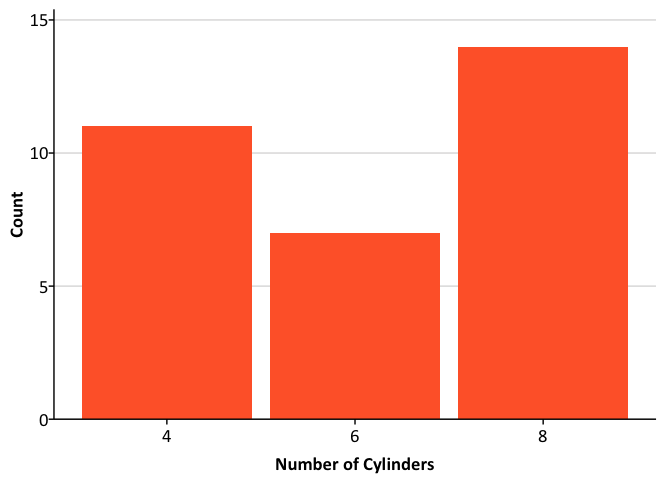
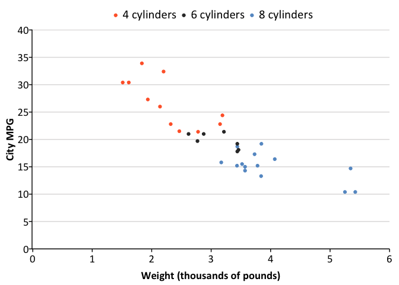

<!-- README.md is generated from README.Rmd. Please edit that file -->

## Overview

`reasontheme` is a set of tools for creating Reason Foundation themed
plots in R. The package extends `ggplot2` with slide, web, and print
themes as well as tools that make plotting easier at the Reason
Foundation.

## Installation

    install.packages("devtools")
    devtools::install_github("ReasonFoundation/reasontheme", build_vignettes = TRUE)

## Fonts

The Reason Foundation uses Calibri font for publications. After
installing `reasontheme`, submit `reasontheme::calibri_test()` to see if
Calibri is imported and registered.

If Calibri isn’t imported and registered, install Calibri and then
submit `reasontheme::calibri_install()`.

## Usage

Always load `library(reasontheme)` after `library(ggplot2)` or
`library(tidyverse)`.

``` r
library(tidyverse)
#> Warning: package 'tibble' was built under R version 3.5.2
#> Warning: package 'tidyr' was built under R version 3.5.2
#> Warning: package 'purrr' was built under R version 3.5.2
#> Warning: package 'dplyr' was built under R version 3.5.2
#> Warning: package 'stringr' was built under R version 3.5.2
#> Warning: package 'forcats' was built under R version 3.5.2
library(reasontheme)
set_reason_theme(style = "slide")
#> Warning: New theme missing the following elements: axis.ticks.length.x,
#> axis.ticks.length.x.top, axis.ticks.length.x.bottom, axis.ticks.length.y,
#> axis.ticks.length.y.left, axis.ticks.length.y.right
ggplot(data = mtcars, mapping = aes(factor(cyl))) +
  geom_bar() + 
  scale_y_continuous(expand = expand_scale(mult = c(0, 0.1))) +
  labs(x = "Number of Cylinders",
       y = "Count")
```



``` r
ggplot(data = mtcars, mapping = aes(x = wt, y = mpg)) +
  geom_point() +
  scale_x_continuous(expand = expand_scale(mult = c(0.002, 0)), 
                     limits = c(0, 6),
                     breaks = 0:6) +
  scale_y_continuous(expand = expand_scale(mult = c(0, 0.002)), 
                     limits = c(0, 40),
                     breaks = 0:8 * 5) +
  labs(x = "Weight (thousands of pounds)",
       y = "City MPG")# +
```


``` r
#  scatter_grid()
```

``` r
mtcars %>%
  mutate(cyl = paste(cyl, "cylinders")) %>%
  ggplot(aes(x = wt, y = mpg, color = cyl)) +
  geom_point() +
  scale_x_continuous(expand = expand_scale(mult = c(0.002, 0)), 
                     limits = c(0, 6),
                     breaks = 0:6) +
  scale_y_continuous(expand = expand_scale(mult = c(0, 0.002)), 
                     limits = c(0, 40),
                     breaks = 0:8 * 5) +
  labs(x = "Weight (thousands of pounds)",
       y = "City MPG") #+
```



``` r
#  scatter_grid()
```

``` r
library(gapminder)
gapminder %>%
  filter(country %in% c("Australia", "Canada", "New Zealand")) %>%
  mutate(country = factor(country, levels = c("Canada", "Australia", "New Zealand"))) %>%
  ggplot(aes(year, gdpPercap, color = country)) +
  geom_line() +
  scale_x_continuous(expand = expand_scale(mult = c(0.002, 0)), 
                     breaks = c(1952 + 0:12 * 5), 
                     limits = c(1952, 2007)) +
  scale_y_continuous(expand = expand_scale(mult = c(0, 0.002)), 
                     breaks = 0:8 * 5000,
                     labels = scales::dollar, 
                     limits = c(0, 40000)) +
  labs(x = "Year",
       y = "Per capita GDP (US dollars)")
```


``` r
txhousing %>%
  filter(city %in% c("Austin","Houston","Dallas","San Antonio","Fort Worth")) %>%
  group_by(city, year) %>%
  summarize(sales = sum(sales)) %>%
  ggplot(aes(x = year, y = sales, fill = city)) +
  geom_area(position = "stack") +
  scale_x_continuous(expand = expand_scale(mult = c(0, 0)),
                     limits = c(2000, 2015),
                     breaks = 2000 + 0:15) +  
  scale_y_continuous(expand = expand_scale(mult = c(0, 0.2)), 
                     labels = scales::comma) +
  labs(x = "Year",
       y = "Home sales")
```


## Branding

``` r
library(ggplot2)
library(reasontheme)
library(grid)
library(gridExtra)
#> 
#> Attaching package: 'gridExtra'
#> The following object is masked from 'package:dplyr':
#> 
#>     combine
set_reason_theme()
#> Warning: New theme missing the following elements: axis.ticks.length.x,
#> axis.ticks.length.x.top, axis.ticks.length.x.bottom, axis.ticks.length.y,
#> axis.ticks.length.y.left, axis.ticks.length.y.right
plot <- ggplot(data = mtcars, mapping = aes(factor(cyl))) +
  geom_bar() + 
  scale_y_continuous(expand = expand_scale(mult = c(0, 0.1))) +
  labs(x = "Number of Cylinders",
       y = "Count") #+
  #remove_ticks()
#grid.arrange(plot, urbn_logo_text(), ncol = 1, heights = c(30, 1))
```

Core themes:

  - `set_reason_theme()`
  - `theme_reason_slide()`
  - `theme_reason_web()`
  - `theme_reason_print()`

<!-- Formatting functions: -->

<!-- * `urbn_logo_text()` -->

<!-- * `remove_ticks()` -->

<!-- * `remove_axis()` -->

<!-- * `scatter_grid()` -->

<!-- * `add_axis()` -->

<!-- * `urbn_geofacet` -->

Utility functions:

  - `calibri_test()`
  - `calibri_install()`

<!-- * `view_palette()` -->
